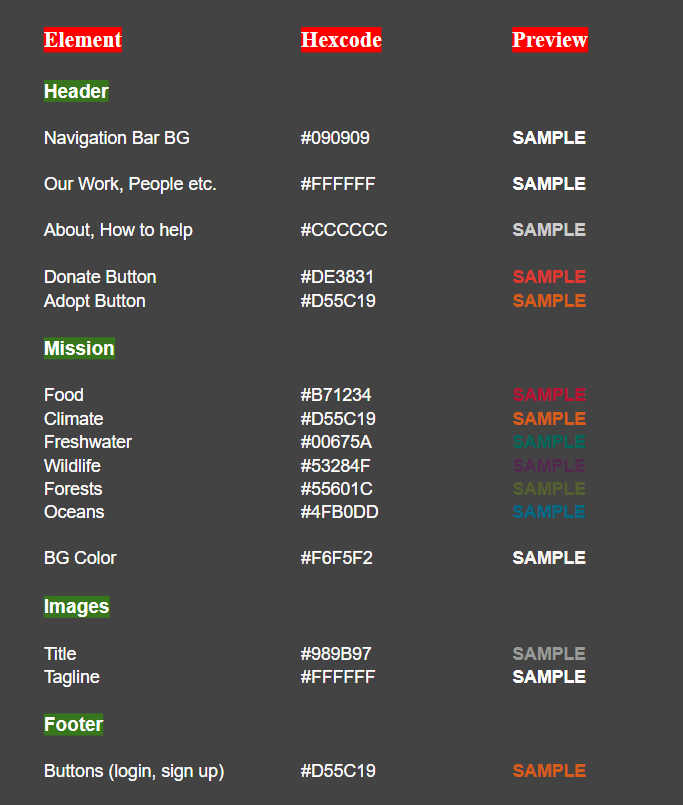

# Global Sanctuary Fund Challenge

## Context
You are a Frontend Developer at Global Sanctuary Fund, a non profit organization which has the mission to conserve nature and preserve the most pressing threats to the diversity of life on earth. 

The Organization yet don't have a Web Presence because of which they are not able to reach a wider audience and accomplish the mission. **Having a Web Presence, would increase the monetary contribution towards the Global Sanctuary Fund and would encourage voluntary participation from individuals**. Also, the millennials are most active in providing support to the organization. Hence, the organization is very keen on reaching the millennials with the information in the best possible way such that the information is ***well presented and organized***.

As a Frontend Developer, you would have to create a Web Page to showcase all the WildLife Conservation services by laying out information in a way that is quickly usable and readable to help GSF reach a wider audience.

### Facts
1. According to a survey, 831 million millennials representing one quarter of the world’s population
2. Each millennial spends around 7.2 hours each day using different websites and mobile applications.
2. On an average these Millennials spend around 12 seconds each page. 
3. Google shares that a new user spends only 3 seconds on a site to find what he wants, and hops on to another.

## Problem Statement
**Create a Web Page which resembles the image below to achieve GSF's Mission.**


### Details
1. The assets required for building the webpage can be found in the `./assets` folders.
2. There are two fonts which is widely used across the page
    1. **OpenSans** - https://fonts.google.com/specimen/Open+Sans
    2. **Roboto Condensed** - https://fonts.google.com/specimen/Roboto+Condensed
3. There are few colors which is widely used across the page.
    
4. Few texts which have been used on the page.
    ```
    CINCINNATI TAKES ON THE CLIMATE CRISIS

    GSF’S MISSION

    Our mission is to conserve nature and reduce the most pressing threats to the diversity of life on Earth.

    We organize our work around these six areas:

    HOW YOU CAN HELP

    Global Sanctuary Fund Inc. is a nonprofit, tax-exempt charitable organization (tax ID number 52-1693387) under Section 501(c)(3) of the Internal Revenue Code. Donations are tax-deductible as allowed by law.

    Global Sanctuary Fund

    1250 24th Street, N.W. Washington, DC 20037

    © 2021 Global Sanctuary Fund. GSF® and ©1986 Deer Symbol are owned by GSF. All rights reserved.
    ```
## Instructions
1. Download and unzip the boilerplate code.
2. Run the command `npm install` to install the dependencies required for automated testing.
3. Open the boilerplate code in VSCode to develop the assignment solution.
4. Add required code in the `index.html` file and create external CSS file to style the web page.
5. First, test the solution locally by running the command `npm run test`.
6. Refactor the solution to ensure all test cases are passing.
7. DO NOT MODIFY THE PROVIDED CODE, ELSE THIS MAY IMPACT THE TEST CODE EXECUTION.
8. Zip the solution code by selecting all the files and folders **excluding** the `node_modules` folder and give the name same as assignment name to the zipped file.
9. Upload the zipped solution for submission.