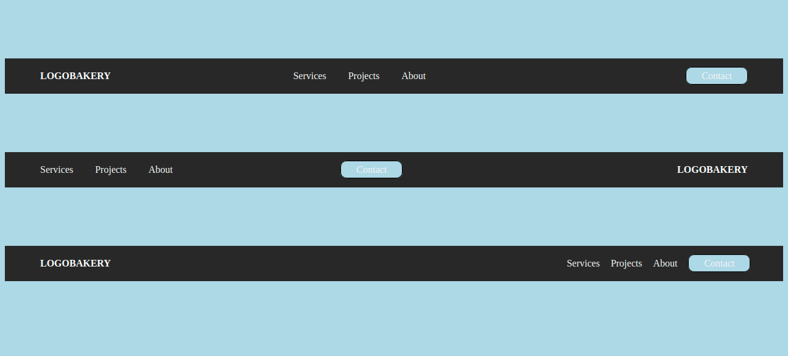

# Nameplate Challenge

## Context
Every newspaper has a nameplate. It’s just about the only thing you can guarantee won’t change from edition to edition. It’s the bit at the top of the front page, and comprises of the publication’s name and logo.

A lot of these are iconic in their own right. The nameplates of publications like The Washington Post and The Sun are seared into the public consciousness. Nameplates are the branding, the bit that says, ‘We’re not that other newspaper. We’re this newspaper.’ It communicates who you are and what you’re about.

Practically every website has a nameplate, only on websites we call it the header.  It’s weird for a website not to have one, and for it not to appear on every page. In news and web design the underlying purpose of the nameplate is the same: **get the brand front and centre and guide users to something they’ll care about**.

## Problem Statement

Create the following headers which resembles the given images below that helps in branding and guiding users to the important sections of the pages.  

## Instructions
1. Download and unzip the boilerplate code.
2. Run the command `npm install` to install the dependencies required for automated testing.
3. Open the boilerplate code in VSCode to develop the assignment solution.
4. Add required code in the `index.html` file and create external CSS file to style the web page.
5. First, test the solution locally by running the command `npm run test`.
6. Refactor the solution to ensure all test cases are passing.
7. DO NOT MODIFY THE PROVIDED CODE, ELSE THIS MAY IMPACT THE TEST CODE EXECUTION.
8. Zip the solution code by selecting all the files and folders **excluding** the `node_modules` folder and give the name same as assignment name to the zipped file.
9. Upload the zipped solution for submission.
